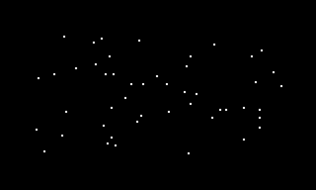
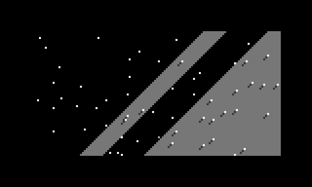
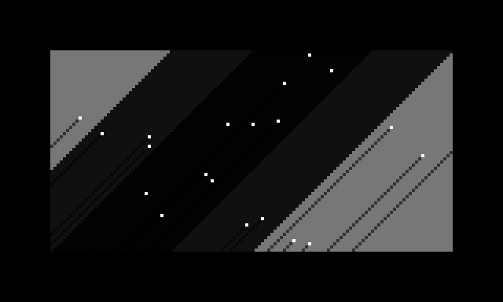

# høst

On norns, I sometimes run a sampler and play some synth notes via nb.

That’s it.

Then, I put it aside and started writing.

I wanted something simple, with few, but impactful controls. I wanted the part where JF breaks apart in noise when modulated by it’s own narrowing square wave. The sparse texture of noise as the logic threshold nears silence. A resonant body to receive this energy. Raw waveforms, unfiltered, electric.

The arc I got in spring (after seeing it get discontinued twice before) became the focus for the engine.

My notes were full of thoughts about SinOscFb.ar(), it promised single sample feedback, just the thing to recreate the feel of the modular. Fun fact, that uGen is deterministic (it does the noise beautifully, but it’s exactly the same every time, completely useless, in other words). Approaching this like patching was not working (yes, I know JF is digital).

Designing becomes a question of language. How do I write, or think, about the synth I want in a way that lets it make sense in four ideas, one for each encoder and what sets of fours will work well together? In what way do I explain to myself the sounds I make in a way that also makes sense to a computer?

The two waveform controls on JF are fun to play, but they could be mapped to one axis, a saw wave becomes a sine, then a square, before vanishing completely.

If noise is the endpoint and a pure tone the start, the transition between can consist of more than just increased levels of self-modulation. White noise can play the role of instability, before fading out, becoming only pink noise, which cuts nicer - the original signal completely lost.

A threshold acts much the same, it translates well, volume, timbre and density in one.

The last is just frequency, from slow rhythm to mellow tone.

A solid foundation, earth to stand on. A droning voice.

Repeating the pattern gives shape to a poly-synth, frequency replaced by shape, moving from short percussive hits, to long decays, through balance, into long buildup that fall away instantly.

Since repetition is already on the table, let the notes repeat while held, and maybe even let them hang until toggled off. A sequencer, but not really. Trying to limit feature, looking for what I need, not what I imagine could become useful.

Airborne detritus, leaves on the wind.

Let’s take a break. I’ve got two synthDefs, and am looking at my Res Eq wondering how i’m going to bring it into this new world of self-imposed limitations.

Then WR start talking about Atrium, which is neat. While I have been spending the summer thinking about how I use their modules, they have spent the past years doing the same, seeing their ideas is inspiring, although it looks like i’m going to get more enjoyment out of the fact that it exists than actually owning one. I take the idea of shifting from signal to resonant body to delay and see how it fits my sett of affordances.

Two bandpass filters into a delay works well as a final stage - saving me from the looming specter of the 10-band feedback-based eq.
This is the final layer. Light.

Høst is everything I have learnt from playing my modular over the past few years, as well as quite a bit of what I have learnt about myself.
It [was] in the community catalog, if you want to try to make sense of it. It’s OK if it doesn’t [or you missed it].

There aren’t any instructions and all the parameters are in Norwegian, but there shouldn’t be much need to look at them.

I’ll probably return to the modular in a while, and I’m curious to see what it has become in my absence.

------- prefece:

About 20 years ago I was a student and started spending my student loan on cheap gear to play noise. Over the next couple of years I put together a tiny setup consisting of a EHX ring modulator and cloned tube mic preamp in a feedback loop, dub-mixed on a terrible mixer with two fully featured channels and a Boss delay pedal. With this setup i could play tones with a wide timbral range, loads of grit and texture, and build up massive swells of sheer noise. Or, pretend everything was just one big karplus strong thing gone wrong. I stuck with that setup for the better part of a decade, but with more distractions and less time to play.

At some point, I saw a massive doepfer system, and got hold of a catalog. Sometimes, I daydreamed about rebuilding my setup as a compact modular synth, but had no $$$ to do anything more. I did manage to acquire and build a 40h and learn some max/msp along the way, but nothing came of it apart from a folder of patches that went “bonk”, “plonk” or “krrrttzzz” in different vaguely amusing ways.

By 2018 I had gotten a propper job (#fml) and started playing modulargrid for real, a year later I had my first 104 hp skiff with what I thought might be the greatest hits of the Lyra 8 and DFAM, the weird pt-delay and noise modulating the Moog filter into self oscillation. I thought the Polyvox was cool so i got the filter from it.

This was really a panicked reaction to the cost of what I thought I really wanted. A small collection of WR modules (which were widely available at the time). It was well reasoned, narrow in focus and could have worked, but none of the modules actually worked well together. The Moog filter gains resonance as frequency increases, on the Polyvox it drops away as frequency decreases, the lovely noisy textures were nowhere to be found. The Lyra FX, wile a great delay, dropped the bass entirely when turning up the distortion. Both varieties of Mutable VCAs are inert when feed back on themselves.

What followed was a slow sell-off and shift towards my original plan. I treated myself to a grid and ansible, just as earthsea became part of the firmware and one could order boards and make a ii backpack to have JF become a poly-synth.

This is where something weird starts happening.

My modular becomes two conflicting concepts manifested as one physical object. On one hand I start realizing that I want less, a focused system with primarily hands-on control, no modulation or VCAs. At the same time I begin thinking about analog computers and patch programming and cybernetics, obsessing over Serge and Joranalogue modules, seeing euro as a post-Serge playground for clever tricks and fun times.

The second of those has nothing to do with music, it’s all about building a mental model of sufficient complexity that I can carry around as, essentially, a comfort-item.

I buy a bigger case. But, not much bigger. The skiff was too wide, it didn’t fit well in my field of vision, the new case is 70 hp, two rows, much better.

I keep optimizing the modules, shifting between maximum potential and complexity and the stupid, simple stuff I actually want to use. Swinging from cognitive overload to a desire for more.

Two things keep me from seeing what’s happening, I still need the soothing modulargrid-tetris, and the culture we are part of being online, on forums and watching content of various kinds. To play the game right, I’m supposed to expand and condense, modulate the modulators, cascade VCAs into more VCAs, etc. If what you want sounds like noise to the sub-niche mainstream signal of the group, it’s easy to loose track of it.

This summer a lot changed. I spent most of it outside, off-grid and away from everything that required comfort in the first place. Most my gear stayed behind, but I thought about playing a lot, and about what I wanted to play with.

Right now my synth is a permanent patch. A Resonant Eq is pinged by the first output of JF. The next three outputs pinger center band of TS, modulate its cutoff and frequency modulated JF. CM acts as a combined volume and timbral gate using the analog logic. Output from the equalizer is routed to norns via PE2. This is, and had been the patch I return to again and again, for years - doesn’t matter what else surrounds it.
